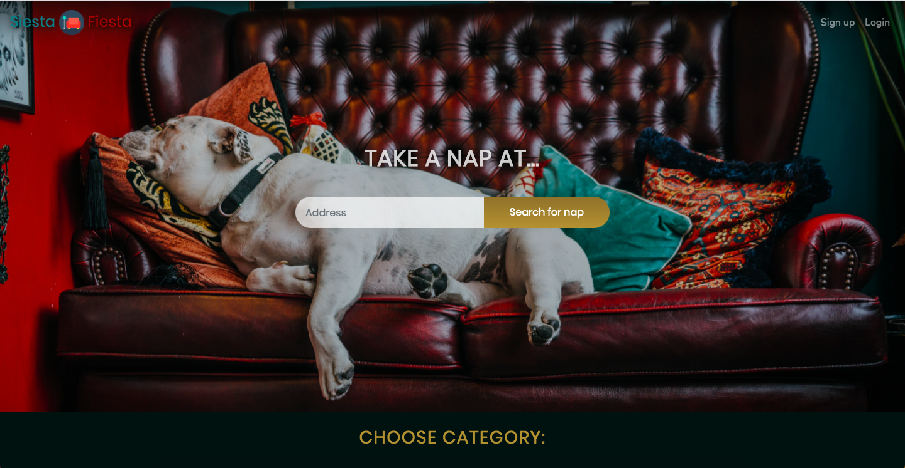
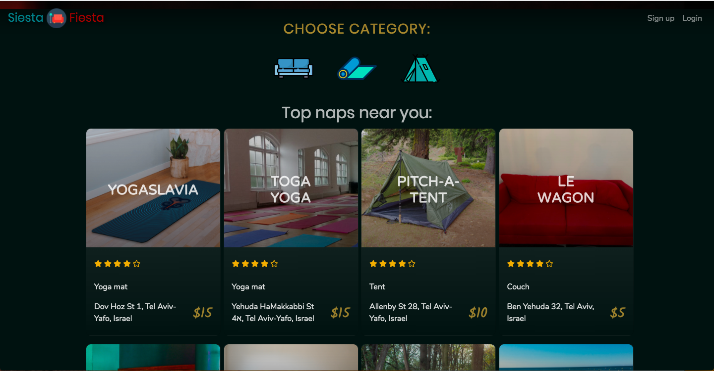
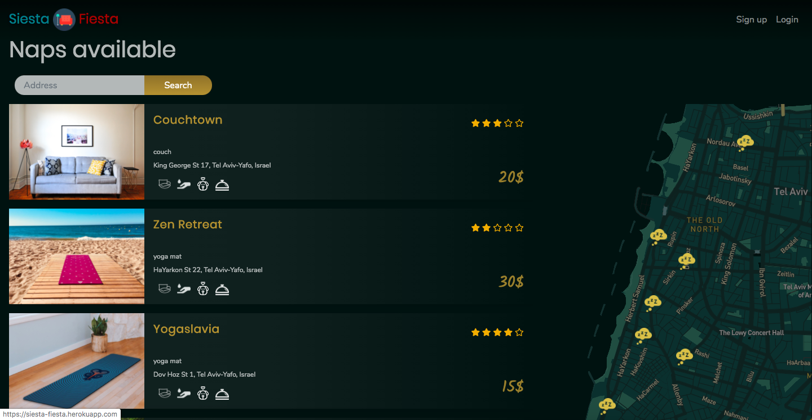
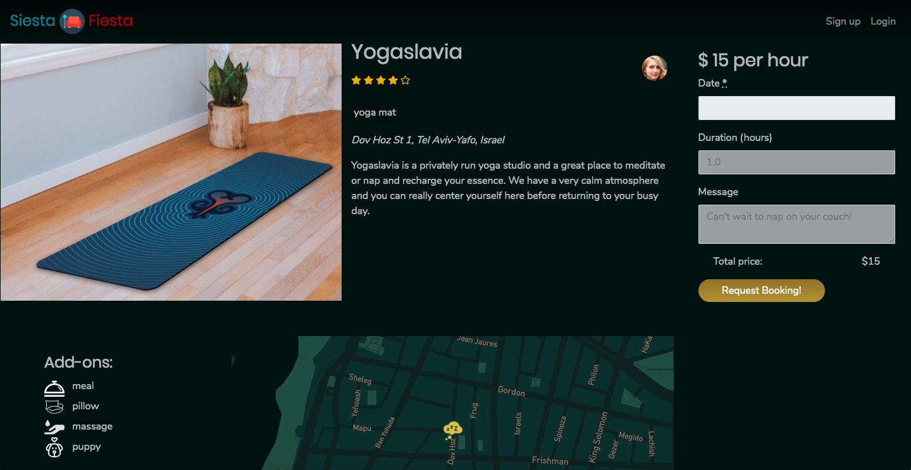

# Siesta Fiesta

  

Siesta Fiesta is the application for your naplication. Find a couch, tent, or yoga mat
to take a nap in the afternoon when you need one.

View it live: (https://siesta-fiesta.herokuapp.com/)

  

  

  

This was an air-bnb-style final project for Le Wagon's 9 week Full-stack coding bootcamp batch 324 in Tel Aviv.

# Technology Used

# Our team
    Omer Geva

    Brad Korman

    Alisa Silina

    Dean Wheeler
